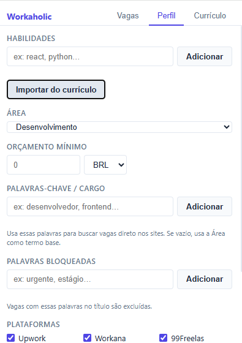
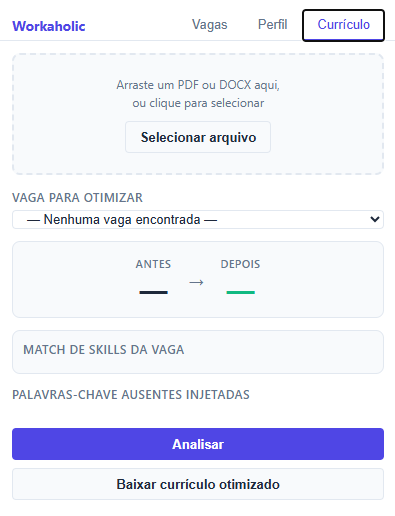

# Workaholic

Workaholic is a Chrome extension that monitors job and freelance platforms, applies your filters locally, and notifies you only when new jobs match your profile.

---

## English

### Features

- Fetches jobs from multiple platforms.
- Applies profile-based filters: skills, keywords/role, blocked words, minimum budget, and enabled platforms.
- Calculates a match score based on job-required skills.
- Enriches low-metadata jobs by extracting skills from title and description.
- Removes duplicate jobs from the same cycle.
- Notifies only new jobs that passed filtering.
- Runs automatic background scans at the configured interval.

### Supported Platforms

- Upwork
- Workana
- 99Freelas
- LinkedIn
- Indeed (BR)
- Gupy

### Install in Chrome (Developer Mode)

1. Download or clone this project.
2. Open Chrome at `chrome://extensions`.
3. Enable `Developer mode`.
4. Click `Load unpacked`.
5. Select the project root folder.

### Install in Firefox (Temporary Add-on)

1. Download or clone this project.
2. Open Firefox at `about:debugging`.
3. Click "This Firefox" link.
4. Click `Load Temporary Add-on`.
5. Select the `manifest.json` file

### First-Time Setup

1. Click the extension icon.
2. Open the `Perfil` tab.
3. Add your skills.
4. Select your main area.
5. Set minimum budget and currency (optional).
6. Add keywords/role for more precise matching (optional).
7. Add blocked words to exclude unwanted titles (optional).
8. Enable the platforms you want to monitor.
9. Set the search frequency.
10. Click `Salvar`.

### How Matching Works

- Jobs are normalized to a single schema.
- Main score uses the job perspective:
  `(your matched skills / total skills required by the job) * 100`.
- When a job has no structured skills, the system infers skills from title and description.
- For sparse enriched jobs, a conservative score rule is applied to avoid artificial inflation.
- Final filtering uses a combination of dynamic minimum score and minimum match count.

### Filtering Flow

1. Check whether the platform is enabled.
2. Remove jobs with blocked words in the title.
3. Apply keywords/role filter (when configured).
4. Apply minimum budget filter (when job budget exists).
5. Compute matches and score.
6. Remove jobs below thresholds.
7. Deduplicate repeated results.
8. Sort by score (highest first).

### Smart Resume (Curriculo Tab)

- Imports PDF or DOCX.
- Extracts skills with controlled filtering to reduce noise.
- Uses a synonym and term catalog to reduce false positives.
- Lets you analyze a selected job and suggest resume keyword improvements.

### Screenshots

#### 1) Jobs tab - manual scan trigger

Caption: main screen for immediate scan execution.
How it works: click `Buscar agora` to fetch jobs from enabled platforms, apply filters, and refresh totals.

#### 2) Profile tab - filters configuration

Caption: profile panel to tune your search criteria.
How it works: define what you want to find and what should be ignored. These settings drive match scoring and job filtering.

#### 3) Resume tab - import and optimization

Caption: resume import and fit analysis module.
How it works: after importing your resume, select a job to compare `Antes` and `Depois`, inspect `Match de skills da vaga`, and download an optimized version.

### Notifications

- Only new jobs that pass filtering trigger notifications.
- The extension badge shows the number of new jobs in the latest cycle.

### Troubleshooting

#### Jobs are not updating

1. Open `chrome://extensions`.
2. Click `Reload` on Workaholic.
3. Open the popup and click `Buscar agora`.

#### Service worker error

Reload the extension in `chrome://extensions` or `about:debugging#/runtime/this-firefox`. If it persists, click `Errors` on Chrome or `Inspect` on Firefox and inspect the latest stack trace.

#### Too few matched jobs

- Review your profile skills.
- Reduce strict keyword/role and blocked word constraints.
- Confirm target platforms are enabled.
- Run a manual search to validate changes.

### Privacy

- Filtering and processing run locally.
- No external backend is required for matching logic.
- Profile and job state are stored in Chrome extension storage.

### Development

- Run tests: `npm test`
- Coverage: `npm run test:coverage`
- Main folders:
  - `background/` scheduling and orchestration
  - `popup/` extension UI
  - `parsers/` pure HTML parsers by platform
  - `scrapers/` platform content scripts
  - `shared/` normalization, filtering, and storage
  - `tests/` automated tests and fixtures

### License

MIT

---

## PT-BR

### Funcionalidades

- Busca vagas em varias plataformas.
- Aplica filtros por perfil: habilidades, palavras-chave/cargo, palavras bloqueadas, orcamento minimo e plataformas ativas.
- Calcula score de aderencia com base nas habilidades exigidas pela vaga.
- Enriquece vagas com pouco metadado extraindo habilidades de titulo e descricao.
- Remove duplicatas de vagas repetidas no mesmo ciclo.
- Notifica somente vagas novas que passaram no filtro.
- Executa buscas automaticas em background no intervalo configurado.

### Plataformas Suportadas

- Upwork
- Workana
- 99Freelas
- LinkedIn
- Indeed (BR)
- Gupy

### Instalacao no Chrome (Modo Desenvolvedor)

1. Baixe ou clone este projeto.
2. Abra o Chrome em `chrome://extensions`.
3. Ative `Modo do desenvolvedor`.
4. Clique em `Carregar sem compactacao`.
5. Selecione a pasta raiz do projeto.

### Instalacao no Firefox (Extensão temporária)

1. Baixe ou clone este projeto.
2. Abra o Firefox em `about:debugging`.
3. Click no link `Este Firefox`.
4. Clique `Carregar extensão temporária…`.
5. Selecione o arquivo`manifest.json` da raíz do projeto.

### Configuracao Inicial

1. Clique no icone da extensao.
2. Abra a aba `Perfil`.
3. Cadastre suas habilidades.
4. Selecione sua area principal.
5. Defina orcamento minimo e moeda (opcional).
6. Adicione palavras-chave/cargo para busca mais assertiva (opcional).
7. Adicione palavras bloqueadas para excluir titulos indesejados (opcional).
8. Marque as plataformas que deseja monitorar.
9. Ajuste a frequencia de busca.
10. Clique em `Salvar`.

### Como Funciona o Match

- As vagas sao normalizadas para um formato unico.
- O score principal usa a visao da vaga:
  `(habilidades suas que batem com a vaga / total de habilidades exigidas pela vaga) * 100`.
- Quando a vaga nao traz habilidades estruturadas, o sistema tenta inferir habilidades pela descricao e titulo.
- Para vagas enriquecidas e esparsas, o score usa uma regra conservadora para evitar inflacao artificial.
- O filtro final considera combinacao de score minimo dinamico e quantidade minima de matches.

### Fluxo de Filtragem

1. Valida se a plataforma esta habilitada.
2. Remove vagas com palavras bloqueadas no titulo.
3. Aplica filtro de palavras-chave/cargo (quando configurado).
4. Aplica orcamento minimo (quando houver valor de vaga).
5. Calcula matches e score.
6. Remove vagas abaixo dos limiares minimos.
7. Deduplica resultados repetidos.
8. Ordena por score (maior para menor).

### Curriculo Inteligente (Aba Curriculo)

- Importa PDF ou DOCX.
- Extrai habilidades de forma controlada para evitar ruido.
- Usa catalogo de termos e sinonimos para reduzir falsos positivos.
- Permite analisar uma vaga e sugerir ajustes de palavras-chave para o curriculo.

### Screenshots

#### 1) Aba Vagas - disparo manual de busca

Legenda: tela principal para iniciar uma varredura imediata.
Como funciona: ao clicar em `Buscar agora`, a extensao coleta vagas nas plataformas habilitadas, aplica filtros e atualiza o total encontrado.

#### 2) Aba Perfil - configuracao dos filtros

Legenda: painel de personalizacao de criterios de busca.
Como funciona: voce define o que deseja encontrar e o que deve ser ignorado. Esses dados alimentam o calculo de match e o filtro das vagas.

#### 3) Aba Curriculo - importacao e otimizacao

Legenda: modulo de importacao de curriculo e analise de aderencia.
Como funciona: apos importar o curriculo, selecione uma vaga para comparar `Antes` e `Depois`, visualizar `Match de skills da vaga` e baixar uma versao otimizada.

### Notificacoes

- Apenas vagas novas e aprovadas no filtro geram notificacao.
- O badge da extensao mostra a quantidade de novas vagas no ultimo ciclo.

### Solucao de Problemas

#### Nao atualiza vagas

1. Abra `chrome://extensions`.
2. Clique em `Recarregar` na extensao Workaholic.
3. Volte ao popup e clique em `Buscar agora`.

#### Erro de service worker

Recarregue a extensao em `chrome://extensions` ou `about:debugging#/runtime/this-firefox`. Se persistir, abra `Erros` no Chrome ou `about:debugging#/runtime/this-firefox` no Firefox e verifique o stack trace mais recente.

#### Poucas vagas com match

- Revise suas habilidades no perfil.
- Reduza restricoes em palavras-chave/cargo e palavras bloqueadas.
- Confirme se as plataformas desejadas estao ativas.
- Execute uma nova busca manual para validar o ajuste.

### Privacidade

- O filtro e o processamento sao locais.
- Nao ha backend externo obrigatorio para logica de matching.
- Perfil e estado das vagas ficam no storage da extensao Chrome.

### Desenvolvimento

- Executar testes: `npm test`
- Cobertura de testes: `npm run test:coverage`
- Pastas principais:
  - `background/` orquestracao e agendamento
  - `popup/` interface da extensao
  - `parsers/` parsers HTML por plataforma
  - `scrapers/` content scripts por plataforma
  - `shared/` normalizacao, filtro e storage
  - `tests/` testes automatizados e fixtures

### Licenca

MIT
