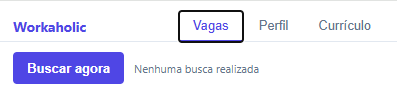
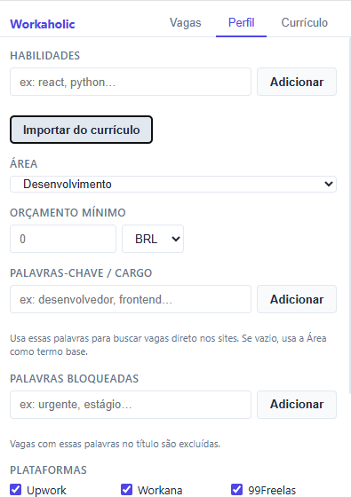
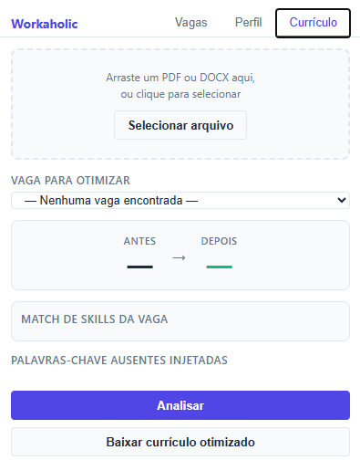

# Workaholic

Workaholic is a cross-browser WebExtension for Firefox, Brave, Opera, Chromium, and Chrome that monitors job and freelance platforms, applies your filters locally, and notifies you only when new jobs match your profile.

https://github.com/user-attachments/assets/6e38c157-889b-4906-89df-641f58043450

---

## English

### Features

- Fetches jobs from multiple platforms.
- Applies profile-based filters: skills, keywords/role, blocked words, minimum budget, and enabled platforms.
- Calculates a match score based on job-required skills.
- Enriches low-metadata jobs by extracting skills from title and description.
- Removes duplicate jobs from the same cycle.
- Notifies only new jobs that passed filtering.
- Runs automatic background scans at the configured interval.
- Local CRM with Kanban panel: every job you mark as applied is mirrored into an 8-column board (Candidatado, Em Analise, Entrevista, Teste Tecnico, Proposta, Aprovado, Rejeitado, Arquivado).
- Drag-and-drop status updates with optimistic UI and automatic rollback on failure.
- Daily follow-up alarm at 09:00 local: generates a context-aware message per pending candidatura and pushes a browser notification. Click to copy the message to the clipboard.
- Export/import the full CRM (applications + portfolio) as a single JSON file.

### Supported Platforms

- Upwork
- Workana
- 99Freelas
- LinkedIn
- Indeed (BR)
- Gupy
- Freelancer
- We Work Remotely
- PeoplePerHour
- Guru

### Install in Chromium Browsers (Chrome, Brave, Opera, Chromium)

**For Users (Pre-built):**

1. Download the latest release from the Releases page.
2. Extract the ZIP file.
3. Open your browser extensions page:
   - Chrome/Brave/Chromium: `chrome://extensions`
   - Opera: `opera://extensions`
4. Enable `Developer mode`.
5. Click `Load unpacked`.
6. Select the extracted folder.

**For Developers:**

1. Clone this repository.
2. Open your browser extensions page (see above).
3. Enable `Developer mode`.
4. Click `Load unpacked`.
5. Select the project root folder.

`npm install` is only required to run tests or build packages — the extension loads unpacked as-is.

https://github.com/user-attachments/assets/6ad8c9de-f772-407a-8845-274b20ce00f8

### Install in Firefox (Temporary Add-on)

**For Users (Pre-built):**

1. Download the latest release from the Releases page.
2. Extract the ZIP file.
3. Open Firefox at `about:debugging`.
4. Click `This Firefox`.
5. Click `Load Temporary Add-on`.
6. Select the `.xpi` file from the extracted folder.

**For Developers:**

1. Clone this repository.
2. Install dependencies: `npm install`
3. Build Firefox package: `npm run build`
4. Open Firefox at `about:debugging`.
5. Click `This Firefox`.
6. Click `Load Temporary Add-on`.
7. Select the .xpi file from the build.

https://github.com/user-attachments/assets/9041a8aa-9a2b-4b88-93bf-4867037549de

### Firefox Signed Distribution

- `workaholic-firefox-unsigned.xpi` is only a packaged artifact. Release and Beta Firefox builds still require AMO signing before installation.
- Build unsigned packages with `npm run build`.
- Sign an unlisted Firefox package with `npm run sign:firefox`.
- Sign a listed AMO submission with `npm run sign:firefox:listed`.
- Set `AMO_JWT_ISSUER` and `AMO_JWT_SECRET` in your shell before signing.
- Update `docs/amo-metadata.json` before the first listed submission on AMO.

### First-Time Setup

1. Click the extension icon in your browser.
2. Open the `Perfil` tab.
3. Add your skills.
4. Select your main area.
5. Set minimum budget and currency (optional).
6. Add keywords/role for more precise matching (optional).
7. Add blocked words to exclude unwanted titles (optional).
8. Enable the platforms you want to monitor.
9. Set the search frequency.
10. Click `Salvar`.

### How Matching Works

- Jobs are normalized to a single schema.
- Main score uses the job perspective:
  `(your matched skills / total skills required by the job) * 100`.
- When a job has no structured skills, the system infers skills from title and description.
- For sparse enriched jobs, a conservative score rule is applied to avoid artificial inflation.
- Final filtering uses a combination of dynamic minimum score and minimum match count.

### Filtering Flow

1. Check whether the platform is enabled.
2. Remove jobs with blocked words in the title.
3. Apply keywords/role filter (when configured).
4. Apply minimum budget filter (when job budget exists).
5. Compute matches and score.
6. Remove jobs below thresholds.
7. Deduplicate repeated results.
8. Sort by score (highest first).

### Smart Resume (Curriculo Tab)

- Imports PDF or DOCX.
- Extracts skills with controlled filtering to reduce noise.
- Uses a synonym and term catalog to reduce false positives.
- Lets you analyze a selected job and suggest resume keyword improvements.

### Apply Tracking & Kanban Panel

- Clicking the `+` button on a job card or downloading the ATS-optimized resume automatically registers the job as a candidatura in the local CRM. Title, link, platform, and description are captured from the scraper output — no manual entry needed.
- Deduplication is based on the normalized job URL, so re-clicking the same card never creates a duplicate record.
- Open the `📋 Painel` button in the jobs toolbar to launch the Kanban dashboard in a new tab. It renders all candidaturas across 8 status columns and supports drag-and-drop reordering.
- Each card exposes three quick actions: regenerate the follow-up message, copy it to the clipboard, or delete the candidatura.
- The header has `Exportar` and `Importar` buttons that download/upload a dated JSON snapshot containing both your candidaturas and your project portfolio. Import is non-destructive (skips IDs that already exist).

### Follow-up Reminders

- A daily alarm fires at 09:00 local time and scans candidaturas whose follow-up date has arrived (3 days for freelancer platforms like Upwork/Workana, 7 days for recruiter platforms like Gupy/LinkedIn).
- For each pending candidatura, the extension generates a tone-adapted message (freelancer vs recruiter, default gentle mode) and shows a notification.
- Clicking the notification opens the extension popup as a tab and copies the message directly to the clipboard, ready to paste into the platform's chat or message field.
- Each candidatura is notified only once per follow-up cycle (tracked via `notificado_em`).

### Screenshots

The images below are the 3 provided screenshots (Jobs, Profile, Resume). Save them to docs/screenshots/ with the filenames below to render them automatically in this README.

#### 1) Jobs tab - manual scan trigger

Caption: main screen for immediate scan execution.
How it works: click `Buscar agora` to fetch jobs from enabled platforms, apply filters, and refresh totals.

#### 2) Profile tab - filters configuration

Caption: profile panel to tune your search criteria.
How it works: define what you want to find and what should be ignored. These settings drive match scoring and job filtering.

#### 3) Resume tab - import and optimization

Caption: resume import and fit analysis module.
How it works: after importing your resume, select a job to compare `Antes` and `Depois`, inspect `Match de skills da vaga`, and download an optimized version.

### Notifications

- Only new jobs that pass filtering trigger notifications.
- The extension badge shows the number of new jobs in the latest cycle.

### Troubleshooting

#### Jobs are not updating

1. Open `chrome://extensions`.
2. Click `Reload` on Workaholic.
3. Open the popup and click `Buscar agora`.

#### Background/service worker error

Reload the extension in `chrome://extensions`, `opera://extensions`, or `about:debugging#/runtime/this-firefox`. If it persists, inspect the latest background error entry for the extension.

#### Too few matched jobs

- Review your profile skills.
- Reduce strict keyword/role and blocked word constraints.
- Confirm target platforms are enabled.
- Run a manual search to validate changes.

### Privacy

- Filtering and processing run locally.
- No external backend is required for matching logic.
- Profile and job state are stored in browser extension storage.

### Development

- Run tests: `npm test`
- Coverage: `npm run test:coverage`
- Build distributables: `npm run build`
- Lint for Firefox/AMO compatibility: `npm run lint:firefox`
- Sign Firefox for self-distribution: `npm run sign:firefox`
- Main folders:
  - `background/` scheduling, orchestration, follow-up alarm
  - `popup/` extension UI (`popup.html`, `dashboard.html`)
  - `parsers/` pure HTML parsers by platform
  - `scrapers/` platform content scripts
  - `shared/` normalization, filtering, storage, CRM modules (`applications.js`, `portfolio.js`, `followup-rules.js`, `followup-message.js`)
  - `tests/` automated tests and fixtures

### License

MIT

---

## PT-BR

### Funcionalidades

- Busca vagas em várias plataformas.
- Aplica filtros por perfil: habilidades, palavras-chave/cargo, palavras bloqueadas, orçamento mínimo e plataformas ativas.
- Calcula score de aderência com base nas habilidades exigidas pela vaga.
- Enriquece vagas com pouco metadado extraindo habilidades de título e descrição.
- Remove duplicatas de vagas repetidas no mesmo ciclo.
- Notifica somente vagas novas que passaram no filtro.
- Executa buscas automáticas em background no intervalo configurado.
- CRM local com painel Kanban: toda vaga marcada como candidatado é espelhada num quadro de 8 colunas (Candidatado, Em Analise, Entrevista, Teste Tecnico, Proposta, Aprovado, Rejeitado, Arquivado).
- Drag-and-drop entre colunas com UI otimista e rollback automático em caso de falha.
- Alarme diário de follow-up às 09:00 local: gera mensagem contextual por candidatura pendente e dispara notificação no navegador. Clique copia a mensagem para a área de transferência.
- Exportar/importar todo o CRM (candidaturas + portfolio) como um único arquivo JSON.

### Plataformas Suportadas

- Upwork
- Workana
- 99Freelas
- LinkedIn
- Indeed (BR)
- Gupy
- Freelancer
- We Work Remotely
- PeoplePerHour
- Guru

### Instalação em navegadores Chromium (Chrome, Brave, Opera, Chromium)

**Para Usuários (Pré-compilado):**

1. Baixe a versão mais recente na página de Releases.
2. Extraia o arquivo ZIP.
3. Abra a página de extensões do navegador:
   - Chrome/Brave/Chromium: `chrome://extensions`
   - Opera: `opera://extensions`
4. Ative `Modo do desenvolvedor`.
5. Clique em `Carregar sem compactação`.
6. Selecione a pasta extraída.

**Para Desenvolvedores:**

1. Clone este repositório.
2. Abra a página de extensões (veja acima).
3. Ative `Modo do desenvolvedor`.
4. Clique em `Carregar sem compactação`.
5. Selecione a pasta raiz do projeto.

`npm install` só é necessário para rodar testes ou gerar pacotes — a extensão carrega sem compactação como está.

https://github.com/user-attachments/assets/6ad8c9de-f772-407a-8845-274b20ce00f8

### Instalação no Firefox (Extensão temporária)

**Para Usuários (Pré-compilado):**

1. Baixe a versão mais recente na página de Releases.
2. Extraia o arquivo ZIP.
3. Abra o Firefox em `about:debugging`.
4. Clique em `Este Firefox`.
5. Clique em `Carregar extensão temporária`.
6. Selecione o arquivo `.xpi` .

https://github.com/user-attachments/assets/9041a8aa-9a2b-4b88-93bf-4867037549de

### Distribuição Assinada no Firefox

- `workaholic-firefox-unsigned.xpi` é apenas um pacote gerado. O Firefox Release e Beta ainda exigem assinatura pela AMO antes da instalação.
- Gere os pacotes com `npm run build`.
- Assine para distribuição própria (unlisted) com `npm run sign:firefox`.
- Assine para listagem pública na AMO com `npm run sign:firefox:listed`.
- Defina `AMO_JWT_ISSUER` e `AMO_JWT_SECRET` no shell antes de assinar.
- Atualize `docs/amo-metadata.json` antes da primeira submissão listada na AMO.

### Configuração Inicial

1. Clique no ícone da extensão no navegador.
2. Abra a aba `Perfil`.
3. Cadastre suas habilidades.
4. Selecione sua área principal.
5. Defina orçamento mínimo e moeda (opcional).
6. Adicione palavras-chave/cargo para busca mais assertiva (opcional).
7. Adicione palavras bloqueadas para excluir títulos indesejados (opcional).
8. Marque as plataformas que deseja monitorar.
9. Ajuste a frequência de busca.
10. Clique em `Salvar`.

### Como Funciona o Match

- As vagas são normalizadas para um formato único.
- O score principal usa a visão da vaga:
  `(habilidades suas que batem com a vaga / total de habilidades exigidas pela vaga) * 100`.
- Quando a vaga não traz habilidades estruturadas, o sistema tenta inferir habilidades pela descrição e título.
- Para vagas enriquecidas e esparsas, o score usa uma regra conservadora para evitar inflação artificial.
- O filtro final considera combinação de score mínimo dinâmico e quantidade mínima de matches.

### Fluxo de Filtragem

1. Valida se a plataforma está habilitada.
2. Remove vagas com palavras bloqueadas no título.
3. Aplica filtro de palavras-chave/cargo (quando configurado).
4. Aplica orçamento mínimo (quando houver valor de vaga).
5. Calcula matches e score.
6. Remove vagas abaixo dos limiares mínimos.
7. Deduplica resultados repetidos.
8. Ordena por score (maior para menor).

### Currículo Inteligente (Aba Currículo)

- Importa PDF ou DOCX.
- Extrai habilidades de forma controlada para evitar ruído.
- Usa catálogo de termos e sinônimos para reduzir falsos positivos.
- Permite analisar uma vaga e sugerir ajustes de palavras-chave para o currículo.

### Rastreamento de Candidaturas & Painel Kanban

- Clicar no botão `+` de um card de vaga ou baixar o currículo otimizado registra automaticamente a vaga como candidatura no CRM local. Título, link, plataforma e descrição são capturados do scraper — sem digitar nada.
- Deduplicação por URL normalizada: clicar duas vezes na mesma vaga nunca cria registro duplicado.
- O botão `📋 Painel` na barra de ferramentas da aba Vagas abre o dashboard Kanban em uma nova aba. Mostra todas as candidaturas nas 8 colunas com drag-and-drop entre elas.
- Cada cartão tem três ações rápidas: regenerar mensagem de follow-up, copiar para clipboard, excluir candidatura.
- O cabeçalho tem botões `Exportar` e `Importar` que baixam/carregam um snapshot JSON com data, contendo candidaturas e portfolio. Import não destrói registros existentes (skipa IDs duplicados).

### Lembretes de Follow-up

- Alarme diário às 09:00 local varre candidaturas cuja data de follow-up chegou (3 dias para plataformas freelancer como Upwork/Workana, 7 dias para plataformas tradicionais como Gupy/LinkedIn).
- Para cada candidatura pendente, a extensão gera uma mensagem com tom adaptado (freelancer vs recrutador, modo padrão gentil) e dispara notificação.
- Clicar na notificação abre o popup da extensão como aba e copia a mensagem direto para a área de transferência, pronta pra colar no chat da plataforma.
- Cada candidatura é notificada apenas uma vez por ciclo de follow-up (controle via `notificado_em`).

### Screenshots

As imagens abaixo correspondem aos 3 screenshots enviados (Vagas, Perfil e Currículo). Coloque os arquivos em docs/screenshots/ com os nomes abaixo para exibição automática no README.

#### 1) Aba Vagas - disparo manual de busca

Legenda: tela principal para iniciar uma varredura imediata.
Como funciona: ao clicar em `Buscar agora`, a extensão coleta vagas nas plataformas habilitadas, aplica filtros e atualiza o total encontrado.

#### 2) Aba Perfil - configuracao dos filtros

Legenda: painel de personalização de critérios de busca.
Como funciona: você define o que deseja encontrar e o que deve ser ignorado. Esses dados alimentam o cálculo de match e o filtro das vagas.

#### 3) Aba Curriculo - importacao e otimizacao

Legenda: módulo de importação de currículo e análise de aderência.
Como funciona: após importar o currículo, selecione uma vaga para comparar `Antes` e `Depois`, visualizar `Match de skills da vaga` e baixar uma versão otimizada.

### Notificações

- Apenas vagas novas e aprovadas no filtro geram notificação.
- O badge da extensão mostra a quantidade de novas vagas no último ciclo.

### Solução de Problemas

#### Não atualiza vagas

1. Abra `chrome://extensions`.
2. Clique em `Recarregar` na extensão Workaholic.
3. Volte ao popup e clique em `Buscar agora`.

#### Erro de background/service worker

Recarregue a extensão em `chrome://extensions`, `opera://extensions` ou `about:debugging#/runtime/this-firefox`. Se persistir, abra a entrada de erro/background mais recente da extensão.

#### Poucas vagas com match

- Revise suas habilidades no perfil.
- Reduza restrições em palavras-chave/cargo e palavras bloqueadas.
- Confirme se as plataformas desejadas estão ativas.
- Execute uma nova busca manual para validar o ajuste.

### Privacidade

- O filtro e o processamento são locais.
- Não há backend externo obrigatório para lógica de matching.
- Perfil e estado das vagas ficam no storage da extensão do navegador.

### Desenvolvimento

- Executar testes: `npm test`
- Cobertura de testes: `npm run test:coverage`
- Gerar pacotes: `npm run build`
- Validar compatibilidade Firefox/AMO: `npm run lint:firefox`
- Assinar pacote Firefox: `npm run sign:firefox`
- Pastas principais:
  - `background/` orquestração, agendamento, alarme de follow-up
  - `popup/` interface da extensão (`popup.html`, `dashboard.html`)
  - `parsers/` parsers HTML por plataforma
  - `scrapers/` content scripts por plataforma
  - `shared/` normalização, filtro, storage, módulos de CRM (`applications.js`, `portfolio.js`, `followup-rules.js`, `followup-message.js`)
  - `tests/` testes automatizados e fixtures

### Licença

MIT
